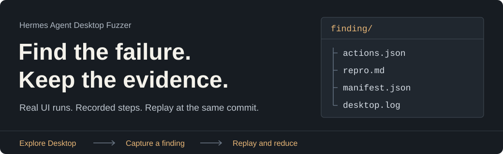

# Hermes Agent Desktop Fuzzer

<picture>
  <source media="(max-width: 600px)" srcset="docs/assets/readme-header-mobile.svg">
  
</picture>

Exercise the real Hermes Desktop app. Catch crashes, hangs, and broken UI flows, then keep the evidence needed to investigate them.

The fuzzer drives chat, settings, onboarding, and extra windows in a temporary profile. Each finding records the target commit and the actions that led to it. Replay checks for the same failure. Reduction searches for fewer steps that still reproduce it.

**[Start a run](#start-a-run)** · **[Inspect a finding](#inspect-a-finding)** · **[Choose a profile](#choose-a-profile)** · **[Command reference](#command-reference)**

An independent testing tool for [Hermes Agent Desktop](https://github.com/NousResearch/hermes-agent). Built around Windows desktop sessions.

## A bug report you can investigate

| When Desktop breaks | What you have to investigate |
| --- | --- |
| A renderer crashes or a window disappears | The recorded actions, process output, and error logs |
| Startup stalls or a page stops responding | The launch profile, config variant, target commit, and captured UI state |
| Chat submits but never shows a reply | The input and submission steps, plus logs from the run |
| The same fault keeps appearing | One clustered finding with hit counts and replay history |
| A long sequence reproduces a hard fault | A search for a shorter sequence, confirmed before it is saved as verified |

Use it after changing a Desktop flow, while investigating a regression, or for a longer campaign across profiles and windows. A seed controls action selection. The saved action list is what you replay to check whether a failure returns.

## Start a run

You need **Node 22.22 or newer**, **Git**, and a **logged-in Windows desktop session** with a working display. The default backend profile also needs **Python 3.11+** and **uv**. A locked or disconnected desktop session can make UI tests fail.

```powershell
git clone https://github.com/Adolanium/hermes-agent-fuzzer.git
cd hermes-agent-fuzzer
.\fuzz.bat
```

You can also double-click `fuzz.bat` after cloning. It installs the runner dependencies if needed, prepares Desktop when its build is missing, and starts one episode. It prints the finding inbox when the run ends and keeps the window open.

The first build can take a while. The runner keeps its own Hermes checkout under `_targets/hermes-agent`; you do not need to clone Hermes separately.

### Give it more time

```powershell
# Eight hours, rotating the available profiles
.\fuzz.bat 8h

# Thirty minutes with fake boot and a mock provider
.\fuzz.bat 30m ui-only
```

`ui-only` does not need a running Python backend. The batch launcher reuses an existing Desktop build. To fetch the latest target and prepare it explicitly, run `npm run fuzz -- prepare`.

### Read the result

```powershell
npm run fuzz -- inbox
```

Open `artifacts/inbox.md` for the same finding list. Each row links a failure to its saved evidence and shows its hit count, status, and replay matches.

## Inspect a finding

A finding is a directory you can inspect and replay. The core files look like this:

```text
artifacts/findings/<stamp>-<id>/
  repro.md          Steps to repeat the failure
  actions.json      Recorded UI actions and their outcomes
  manifest.json     Target commit, profile, seed, and run settings
  state.json        Captured route and UI state
  seed.txt          Seed used for the episode
  desktop.log       Desktop log output
  pageerror.log     Renderer errors
  stdout.log        Process output
  stderr.log        Process errors
  agent.log         Backend log output
```

The directory also includes `config.yaml` when available and `shot-*.png` screenshots when captured. Confirmed reductions add `actions.min.json`. Unverified cuts are kept separately as `actions.candidate.json`.

### Replay it, then shorten it

Set `$finding` to the directory shown in your inbox:

```powershell
$finding = 'artifacts\findings\<stamp>-<id>'

npm run fuzz -- replay $finding
npm run fuzz -- reduce $finding
npm run fuzz -- replay $finding --minimized
```

Replay prepares the recorded commit and restores the saved execution settings. It checks for the original failure before the sequence and after each action. A different crash does not count as a match. Missing windows or changed action outcomes report where replay diverged.

**Keep the best confirmed reproduction.** A new duplicate increases the hit count without replacing a confirmed reproduction with a shorter unverified one. Failed replay attempts remain in the history.

<details>
<summary>Replay rules and reduction limits</summary>

- The configured target remote must match the artifact. `--skip-fetch` requires the commit to be available locally. `--skip-build` requires a matching build stamp for the commit, Node version, and lockfile.
- `--allow-drift` tests the current target instead. Results from another commit do not become verified evidence for the recorded commit.
- Replay restores saved windows, profile, config variant, timing budgets, and the unsafe setting. Older manifests remain readable, though missing execution settings cannot be reconstructed fully. Invalid actions are rejected.
- Matching uses failure severity and a fingerprint of the class, normalized stack, route, and alert text.
- Hard-fault reduction has a default search budget of 15 minutes or 40 replays, followed by a final confirmation. It keeps a shorter verified sequence if a later reduction produces a longer one.
- Soft alert and no-reply findings can receive quick, unverified cuts. `--no-reduce` also disables those cuts. Reductions against another commit are saved as candidates.
- `replay-result.json` records `matched`, `different-failure`, `not-reproduced`, `diverged`, or `runner-error`. Setup errors and action divergence are not evidence that the bug disappeared.
- SQLite stores occurrences and replay attempts separately. The inbox shows replay matches and attempts for the retained sequence at its verified commit. Older databases migrate without invented replay history.

</details>

## What it exercises

The runner combines scripted workflows with guided navigation and random UI actions. Seeds control profile rotation, extra windows, and config variants. You can also choose a fixed profile or window set.

| Area | Examples |
| --- | --- |
| Everyday flows | New session, chat submission, command palette, keyboard shortcuts |
| First run and settings | Onboarding, provider setup, appearance changes, settings tabs |
| Desktop pages | Skills, cron, profiles, agents, messaging, webhooks, artifacts, starmap, command center |
| Extra windows | HUD, Quick Entry, overlay, and the wake renderer |
| Difficult inputs | Broken YAML, missing providers, bad URLs, large context settings, Unicode and unusual text |
| Provider responses | Normal replies, HTTP errors, truncated responses, long text, and markdown |

Hard findings stop the episode. These include process exits, renderer crashes, uncaught page errors, main-process exceptions, error boundaries, vanished windows, hangs, and startup timeouts. The default hang budget is 20 seconds.

Soft findings are stored while the episode can continue. These include selected error alerts, signs of a frozen UI, missing chat replies, and relevant console or log errors. Routine notices are filtered out. Slow actions are logged separately and are not saved as findings.

<details>
<summary>Full route and workflow list</summary>

- Routes: `/`, `/settings`, `/skills`, `/messaging`, `/webhooks`, `/artifacts`, `/cron`, `/profiles`, `/agents`, `/starmap`, `/command-center`.
- Settings: model, chat, appearance, workspace, safety, browser, memory, voice, advanced, providers, gateway, keybinds, keys, notifications, billing, plugins, sessions, about.
- Skills: skills, toolsets, MCP. The known plugin route is `/kanban`.
- Workflows: command palette, new session, shortcuts, page actions, appearance save, chat submit, onboarding, and resize.
- Chat uses recorded input and Enter submission in `[data-slot="composer-rich-input"]`. Send `__mock_ok__` for the normal mock reply, `__mock_500__` for an HTTP error, or `__mock_truncate__` for a truncated response.

These are the routes and controls known to the explorer. Visiting a page does not establish complete test coverage. Native wake is macOS-only; on Windows, the runner visits its renderer through `?win=wake`.

</details>

## Choose a profile

| Profile | Use it to exercise |
| --- | --- |
| `mock-backend` | The real `hermes serve` backend with a local mock LLM. This is the default. |
| `ui-only` | Desktop with fake boot and a mock provider, without a running Python backend. |
| `no-provider` | First-run onboarding and provider settings with an empty config. |
| `packaged` | An existing Windows package under the isolated target's `release/win-unpacked`. |
| `all` | A rotation of profiles. Packaged joins only when its executable exists. |

The seed also selects a config variant: `sane`, `broken-yaml`, `missing-provider`, `huge-context`, `bad-url`, or `auto-approvals`.

## Keep your normal profile separate

Every episode gets a temporary `HERMES_HOME`, `HERMES_DESKTOP_USER_DATA_DIR`, and unique app name. The child environment has credential variables removed. The runner uses its own target checkout and refuses to overwrite tracked edits when switching revisions.

The mock does not return tool calls by default. A denylist blocks update checks, OAuth, diagnostics uploads, git plugin installs, and terminal typing. `--unsafe-surfaces` removes that denylist and allows mock tool calls when requested with `__mock_tools__`.

This isolation separates application data. It is not an operating-system security boundary. Electron launches with `--disable-gpu --no-sandbox`. The runner cleans up the launched app and temporary profile after an episode unless you use `--keep-sandbox`.

## Command reference

Use `npm run fuzz --` to pass commands to the CLI:

```powershell
npm install
npm run fuzz -- prepare
npm run fuzz -- run --profile ui-only --actions 50
npm run fuzz -- run --duration 8h --profile all
npm run fuzz -- run --profile mock-backend --windows all --seed 11 --actions 50
```

`run` prepares the target unless told to reuse it. The default action budget is 50, after route warmup and scripted workflows. Without `--duration`, it runs one episode.

| Option | Purpose |
| --- | --- |
| `--profile` | Select a launch profile |
| `--windows main`, `--windows hud,quick`, `--windows all` | Choose windows; omit to rotate extras by seed |
| `--seed`, `--actions` | Set the random seed and action budget |
| `--duration` | Run a timed campaign, such as `30m` or `8h` |
| `--skip-fetch`, `--skip-build` | Reuse the current target and build, subject to replay checks |
| `--minimized` | Replay the saved confirmed reduction |
| `--allow-drift` | Replay or reduce against the current target commit |
| `--no-reduce`, `--keep-sandbox` | Skip reduction or retain temporary application data |
| `--coverage` | Save an optional V8 coverage report |
| `--unsafe-surfaces` | Remove action restrictions and permit mock tool calls |

Copy [fuzzer.config.example.json](fuzzer.config.example.json) to `fuzzer.config.json` to change the target or timing budgets. The local config is ignored by Git. Set `target.cloneReference` to an existing Hermes checkout to use it as a Git object cache; the runner still creates its own copy.

<details>
<summary>Target builds and campaign execution</summary>

The runner fetches the configured branch, `main` by default, and checks out its commit in `_targets/hermes-agent`. It reuses a build when the commit, lockfile, Node version, and expected build files match. Timed campaigns check for target updates at the configured fetch interval.

Each episode prepares a profile, launches Desktop, waits for a usable or failed startup state, opens requested windows, visits known routes, and runs scripted workflows. It then spends the action budget on guided and random actions, checking for failures as it goes.

The coverage graph records visited UI states and tried actions in `artifacts/coverage.json`. It persists across episodes for inspection. Corpus mutation helpers exist in the source, but current campaigns select through the guided and random path.

</details>

### Results for scripts

Every campaign writes `artifacts/campaign-result.json` with episode and action counts, successful actions, finding counts, target commits, timestamps, and any runner error.

| Exit code | Campaign | Replay or reduction |
| --- | --- | --- |
| `0` | Completed without hard findings; soft findings may exist | Original failure matched |
| `1` | Setup or runner failure | Invalid artifact, setup error, or replay divergence |
| `2` | Hard findings detected | Original failure did not reproduce, or a different failure occurred |

### Longer runs

[scripts/nightly.ps1](scripts/nightly.ps1) runs an eight-hour campaign by default. [scripts/install-nightly-task.ps1](scripts/install-nightly-task.ps1) registers it with Windows Task Scheduler. Keep the machine logged in with a working desktop session.

## Development and support

```powershell
npm test
npm run typecheck
```

`test.bat` also runs the test suite. A separate Electron test launches a hidden fixture, injects a renderer crash, replays and reduces it, rejects an unrelated fault, and checks missing-window reporting.

<details>
<summary>Run the real Electron test</summary>

Point to an installed Electron executable:

```powershell
$env:FUZZ_TEST_ELECTRON = 'C:\path\to\electron.exe'
npx vitest run tests/electron.integration.test.ts
```

The normal suite skips this test unless the variable is set. The repository's [workflow definition](.github/workflows/smoke.yml) includes unit, Electron regression, and scheduled or manual target smoke jobs. Target smoke runs prepare Desktop and attempt to upload artifacts after the campaign.

</details>

Windows with one worker is the current focus. Packaged runs need an existing executable. Linux and macOS are not yet fully supported, and plugin pages depend on what the target Desktop build provides.

Found a problem with the runner? [Open an issue](https://github.com/Adolanium/hermes-agent-fuzzer/issues) with the command, target commit, and relevant logs. Review captured text, config, and screenshots before sharing them.
